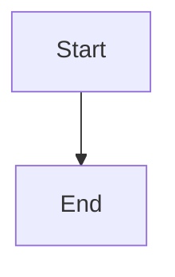

# Architecture Diagrams

This directory contains Mermaid diagram source files for the project's architecture documentation.

## ✅ Generated Diagrams - High Resolution

All 13 architecture diagrams have been generated as **high-resolution PNG images** and are available in `docs/diagrams/`:

**Generation Settings**: 2400px width, 3x scale, transparent background for maximum clarity

| Diagram | Source | Image | Size | Resolution |
|---------|--------|-------|------|-----------|
| Overall Architecture | [01-overall-architecture.mmd](mermaid/01-overall-architecture.mmd) | [PNG](diagrams/01-overall-architecture.png) | 274 KB | ~3500x3300 |
| Clean Architecture Layers | [02-clean-architecture-layers.mmd](mermaid/02-clean-architecture-layers.mmd) | [PNG](diagrams/02-clean-architecture-layers.png) | 242 KB | ~3500x3300 |
| Caching System | [03-caching-system.mmd](mermaid/03-caching-system.mmd) | [PNG](diagrams/03-caching-system.png) | 317 KB | ~3500x3300 |
| Data Flow | [04-data-flow.mmd](mermaid/04-data-flow.mmd) | [PNG](diagrams/04-data-flow.png) | 421 KB | ~3500x3300 |
| Security Architecture | [05-security-architecture.mmd](mermaid/05-security-architecture.mmd) | [PNG](diagrams/05-security-architecture.png) | 328 KB | ~3500x3300 |
| Input/Output/Effect Pattern | [06-input-output-effect-pattern.mmd](mermaid/06-input-output-effect-pattern.mmd) | [PNG](diagrams/06-input-output-effect-pattern.png) | 338 KB | 3687x3468 |
| **Navigation Flow (Split by Module)** | | | **2.4 MB** | |
| ├─ Complete Flow | [07-navigation-flow.mmd](mermaid/07-navigation-flow.mmd) | [PNG](diagrams/07-navigation-flow.png) | 1.4 MB | ~4000x5000 |
| ├─ Overview | [07a-navigation-overview.mmd](mermaid/07a-navigation-overview.mmd) | [PNG](diagrams/07a-navigation-overview.png) | 256 KB | ~3500x3300 |
| ├─ Home & Core | [07b-navigation-home-core.mmd](mermaid/07b-navigation-home-core.mmd) | [PNG](diagrams/07b-navigation-home-core.png) | 281 KB | ~3500x3300 |
| ├─ Users Module | [07c-navigation-users.mmd](mermaid/07c-navigation-users.mmd) | [PNG](diagrams/07c-navigation-users.png) | 141 KB | ~3500x3300 |
| ├─ Projects Module | [07d-navigation-projects.mmd](mermaid/07d-navigation-projects.mmd) | [PNG](diagrams/07d-navigation-projects.png) | 141 KB | ~3500x3300 |
| ├─ Tasks Module | [07e-navigation-tasks.mmd](mermaid/07e-navigation-tasks.mmd) | [PNG](diagrams/07e-navigation-tasks.png) | 132 KB | ~3500x3300 |
| └─ Analytics Module | [07f-navigation-analytics.mmd](mermaid/07f-navigation-analytics.mmd) | [PNG](diagrams/07f-navigation-analytics.png) | 157 KB | ~3500x3300 |

**Total Size**: 4.3 MB (13 diagrams at high resolution - 9x larger than original 467 KB)

All diagrams are displayed in the main [README.md](../README.md) Architecture Overview section.

## Available Diagrams

### 01. Overall Architecture
**File**: `mermaid/01-overall-architecture.mmd`

Shows the high-level 3-layer Clean Architecture:
- **Presentation Layer**: Components + ViewModels
- **Domain Layer**: Services + Entities
- **Data Layer**: Repositories + API + DTOs

### 02. Clean Architecture Layers
**File**: `mermaid/02-clean-architecture-layers.mmd`

Detailed view of each layer with dependencies:
- External interactions (User, Backend API)
- Layer responsibilities and boundaries
- Data flow between layers

### 03. Caching System
**File**: `mermaid/03-caching-system.mmd`

4-layer offline-first caching strategy:
1. Memory Cache (~1ms)
2. LRU Cache (~2ms)
3. IndexedDB (~10ms)
4. API Request (~200ms)

Shows cache hit/miss flow and write-back strategy.

### 04. Data Flow
**File**: `mermaid/04-data-flow.mmd`

Sequence diagram showing complete data flow:
- User interaction → Component → ViewModel → Service → Repository
- Cache check → API fallback
- Response transformation (DTO → Domain)
- Signal updates → UI re-render

### 05. Security Architecture
**File**: `mermaid/05-security-architecture.mmd`

Security layers and data protection:
- HTTP interceptors (Auth + Error)
- Input sanitization flow
- CSP headers and security policies
- XSS detection and prevention

### 06. Input/Output/Effect Pattern
**File**: `mermaid/06-input-output-effect-pattern.mmd`

ViewModel architecture pattern:
- **INPUTS**: User actions and lifecycle events
- **OUTPUTS**: Signals and computed values
- **EFFECTS**: One-time side effects (navigation, toasts)

### 07. Navigation Flow (NavGraph Pattern) - Split by Module
**Files**: `mermaid/07a-07f-navigation-*.mmd` (6 diagrams)

Centralized navigation architecture using NavGraphService, split into readable module-specific diagrams:

**07a. Navigation Overview**
- High-level view of all navigation modules
- Entry point and module selection
- Complete navigation flow

**07b. Home & Core Pages** (8 routes)
- `/home`, `/calendar`, `/messages`, `/documents`
- `/profile`, `/settings`, `/notifications`, `/help`

**07c. Users Module** (4 routes)
- User List → Select Action → View Details / Create / Edit
- Routes: `/users`, `/users/:id`, `/users/new`, `/users/:id/edit`

**07d. Projects Module** (3 routes)
- Select View → List / Create / Archived
- Routes: `/projects`, `/projects/new`, `/projects/archived`

**07e. Tasks Module** (3 routes)
- Select Filter → My / Recent / Important
- Routes: `/tasks/my`, `/tasks/recent`, `/tasks/important`

**07f. Analytics Module** (3 routes)
- Select Report → Overview / Reports / Performance
- Routes: `/analytics/overview`, `/analytics/reports`, `/analytics/performance`

**Benefits**:
- Each diagram is highly readable with large text
- Focused, module-specific views
- Easy to understand individual flows
- Color-coded by module for consistency

---

## Generating PNG Images

You can generate PNG images from Mermaid diagrams using several methods:

### Method 1: High-Resolution Generation (RECOMMENDED)

**Use the provided script** for high-resolution, crystal-clear diagrams:

```bash
# Run the high-resolution generation script
bash docs/generate-diagrams-large.sh
```

This script generates diagrams with:
- ✅ **Width**: 2400px (3x larger than default)
- ✅ **Scale**: 3x for crisp rendering
- ✅ **Resolution**: ~3500x3300 pixels
- ✅ **Background**: Transparent
- ✅ **File Size**: 100-400 KB per diagram
- ✅ **Quality**: Suitable for presentations and high-DPI displays

**Requirements**:
```bash
npm install -g @mermaid-js/mermaid-cli
```

### Method 2: Standard Resolution (Mermaid CLI)

For smaller file sizes with standard resolution:

```bash
# Create output directory
mkdir -p docs/diagrams

# Generate PNG for each diagram at standard size
for file in docs/mermaid/*.mmd; do
  filename=$(basename "$file" .mmd)
  mmdc -i "$file" -o "docs/diagrams/$filename.png" -b transparent
  echo "Generated: docs/diagrams/$filename.png"
done
```

### Method 2: Online Mermaid Editor

1. Visit [Mermaid Live Editor](https://mermaid.live/)
2. Copy the contents of each `.mmd` file
3. Paste into the editor
4. Click "Actions" → "Download PNG"
5. Save to `docs/images/`

### Method 3: VS Code Extension

1. Install extension: "Markdown Preview Mermaid Support"
2. Open any `.mmd` file in VS Code
3. Right-click diagram → "Export Diagram as PNG"
4. Save to `docs/images/`

### Method 4: GitHub Integration

GitHub automatically renders Mermaid diagrams in Markdown files. You can:
- Embed `.mmd` code directly in Markdown:

````markdown

````

- Or link to the live editor:
```markdown

```

---

## Using Diagrams in Documentation

### In README.md

Reference the diagrams using relative paths:

```markdown
## Architecture Overview


### Clean Architecture Layers


```

### In ARCHITECTURE.md

For detailed technical documentation:

```markdown
## Caching Strategy

The application uses a 4-layer caching system:


### Cache Levels
1. **Memory Cache**: Instant access (~1ms)
2. **LRU Cache**: Fast in-memory (~2ms)
3. **IndexedDB**: Persistent storage (~10ms)
4. **API**: Network request (~200ms)
```

---

## Diagram Customization

### Themes

Mermaid CLI supports multiple themes:
- `default` - Light theme
- `dark` - Dark theme (recommended)
- `forest` - Green theme
- `neutral` - Grayscale

```bash
mmdc -i input.mmd -o output.png -t dark
```

### Background

```bash
# Transparent background (recommended for docs)
mmdc -i input.mmd -o output.png -b transparent

# White background
mmdc -i input.mmd -o output.png -b white

# Custom color
mmdc -i input.mmd -o output.png -b "#f5f5f5"
```

### Resolution

```bash
# Higher resolution (default: 800x600)
mmdc -i input.mmd -o output.png -w 1920 -h 1080

# Scale factor
mmdc -i input.mmd -o output.png -s 2
```

---

## Maintenance

### Updating Diagrams

1. Edit the `.mmd` source file in `docs/mermaid/`
2. Regenerate PNG using one of the methods above
3. Commit both the `.mmd` source and PNG output

### Versioning

Keep diagram sources in version control:
- ✅ Commit `.mmd` files (source of truth)
- ✅ Commit `.png` files (for easy viewing)
- ❌ Don't ignore generated images (they're part of docs)

---

## Resources

- [Mermaid Documentation](https://mermaid.js.org/)
- [Mermaid Live Editor](https://mermaid.live/)
- [Mermaid CLI](https://github.com/mermaid-js/mermaid-cli)
- [Mermaid Syntax Guide](https://mermaid.js.org/intro/)
- [Graph Types](https://mermaid.js.org/syntax/flowchart.html)

---

## Troubleshooting

### Mermaid CLI Issues

**Error: Puppeteer Chromium not found**
```bash
# Install Chromium
npm install -g puppeteer
```

**Error: Permission denied**
```bash
# Fix permissions
sudo chown -R $(whoami) /usr/local/lib/node_modules
```

### Rendering Issues

**Diagram too large**
- Adjust `--width` and `--height` parameters
- Simplify complex diagrams
- Split into multiple diagrams

**Text overlap**
- Increase node padding in Mermaid config
- Use shorter labels
- Adjust graph direction (`TB`, `LR`, `RL`, `BT`)

---

## Contributing

When adding new diagrams:

1. Create `.mmd` file in `docs/mermaid/`
2. Use consistent naming: `##-diagram-name.mmd`
3. Follow existing style and color schemes
4. Generate PNG and add to `docs/images/`
5. Update this document with diagram description
6. Reference diagram in appropriate documentation files
